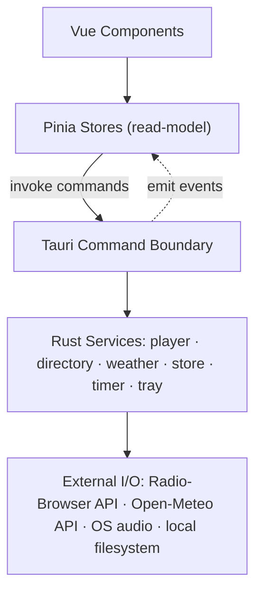

# Architecture Spine — WinRadio

## Design Paradigm

**Layered.** Vue components → Pinia stores → **Tauri command boundary** (the only point frontend and backend touch — Vue never calls Radio-Browser, Open-Meteo, or the filesystem directly) → Rust services (player, directory client, weather client, store, timer, tray) → external I/O (HTTP APIs, OS audio device, local filesystem).



Folders stay flat-by-type on both sides (`components/`, `stores/` on the frontend; each service its own module on the backend) — no feature-sliced folders. Six features on a solo project doesn't earn that ceremony.

## Invariants & Rules

### AD-1 — Tauri command boundary is the sole frontend/backend crossing point

- **Binds:** all, NFR-4
- **Prevents:** Vue code independently calling Radio-Browser/Open-Meteo/filesystem directly, bypassing Rust-side error handling, rate limiting, and the NFR-3 degradation contract.
- **Rule:** Every network or filesystem operation is a Tauri command. The frontend has zero `fetch()`/`XMLHttpRequest` calls to external hosts. Per NFR-4, every command distinguishes "no network at all" from "request succeeded, zero results" in its error — the frontend needs this distinction to render EXPERIENCE.md's two different empty-search messages (offline vs. genuine zero-match) rather than collapsing them.

### AD-2 — Brownfield split: extend the Rust core, rewrite the Vue frontend

- **Binds:** all
- **Prevents:** patching existing Vue markup that shares neither the target IA (Station List rail, Now-Playing Dashboard, three Info Tiles) nor the visual language (DESIGN.md's flat/dark Metro look vs. the existing light rounded-card style).
- **Rule:** `audio/`, `store.rs`, `timer.rs`, `tray.rs` are extended, not replaced. `src/components/`, `App.vue`, and both Pinia stores are rewritten from scratch against `DESIGN.md`/`EXPERIENCE.md`; no existing component markup is reused as a starting point.

### AD-3 — Audio streaming goes through `stream-download` + `icy-metadata`, never hand-rolled

- **Binds:** FR-2, FR-4, FR-5, FR-6
- **Prevents:** reintroducing a blocking call (`Handle::current().block_on()`) inside a synchronous `rodio::Source` iterator — the anti-pattern found in the current `HttpStreamSource`, a likely source of playback instability.
- **Rule:** HTTP stream fetch + ICY metadata parsing uses the `stream-download` (0.24) + `icy-metadata` (0.6, `default-features = false` — its default `reqwest` feature pulls a second, incompatible `reqwest 0.13` alongside the pinned `reqwest 0.12`; `stream-download` already owns the HTTP fetch, so `icy-metadata`'s own reqwest convenience layer isn't needed) crate pair feeding `rodio`. No custom byte-level ICY parser, no `block_on` inside an `Iterator::next()`. **Verification caveat:** `icy-metadata`'s own test suite targets `stream-download 0.23`/`rodio 0.21`, not the exact `0.24`/`0.19` pinned here — treat this three-way pairing as needing a short build spike before it's load-bearing, not as pre-verified to compile together.

### AD-4 — Playback and metadata state is pushed via Tauri events, never polled

- **Binds:** FR-5, FR-6, FR-12
- **Prevents:** the frontend re-adding a polling loop against `get_metadata`-style commands, which wastes cycles in a tray-resident always-open app and adds latency to state changes; a failed-after-retry stream silently collapsing into the same visual state as a user-initiated pause.
- **Rule:** Rust emits an event on every playback/metadata state change: `play`, `stop` (user- or system-initiated, no reason payload — a plain pause), `reconnecting`, `playback-error` (carries a user-facing reason string, renders in `DESIGN.md.colors.error` per EXPERIENCE.md's "Stream failed" state), and `metadata-updated` (ICY track/title; absent ICY data is normal, not a failure — the field is simply empty, no error payload). `metadata-updated` **is** the "now-playing metadata" event; there is no second, separate now-playing event. `playback-error` is distinct from `stop` specifically so the frontend can tell "paused" from "failed" apart. **Retry policy:** on a stream drop, retry immediately once, then back off (2s, 5s, 10s) for up to 3 attempts within a ~20s total budget before firing `playback-error`; `reconnecting` stays active for that whole window. **Scope:** `playback-error` covers only failures that stop or degrade audio output itself (connect/decode/retry-exhausted) — an ancillary, display-only failure inside `player.rs` (e.g. the FR-9 IP lookup, AD-5) never fires `playback-error`, even though it originates in the same module; it always routes through AD-5's per-tile degradation instead. Pinia stores are a read-model populated by commands (initial load) and events (live updates) — they never poll.

### AD-5 — Info Tile data is independent, ephemeral, and event-pushed — never persisted, never bundled

- **Binds:** FR-7, FR-8, FR-9, NFR-3
- **Prevents:** a slow Weather or Location fetch delaying the track title or blocking the dashboard; someone persisting the resolved stream IP as if it were catalog data; a failed fetch leaving its tile stuck in a loading state forever (since polling is banned); two tiles picking incompatible payload shapes and breaking the shared `InfoTile.vue` shell.
- **Rule:** Location info, Weather info, and Stream info (the three Info Tile categories — now-playing metadata is AD-4's, not this AD's) are each their own Tauri event, and **all three share one payload envelope**: `{ ok: boolean, data: T | null, reason: string | null }`. Each is emitted exactly once per attempt, on success (`ok: true`, `data` populated) or on failure (`ok: false`, `reason` set) — never silence, never a bespoke per-tile shape. This is what gives each Info Tile a defined, non-polled path out of loading into either real data or EXPERIENCE.md's quiet degraded copy ("Weather unavailable," etc.). Stream Info's `data` carries codec/bitrate/country **sourced synchronously from the already-loaded `Station` object** (no network call — these are cached fields) plus the DNS-resolved IP, which is the one genuinely async part of that event; Location's `data` likewise reads `geoLat`/`geoLong` off the cached `Station` first and only emits `ok: false` if the station has none — no redundant `directory.rs` round-trip at play-time for coordinates already in hand. None of this data is written to the local store — it exists only for the current playback session. This is the concrete mechanism behind NFR-3's "tiles degrade independently" promise.

### AD-6 — Every struct crossing the Tauri boundary derives `#[serde(rename_all = "camelCase")]`

- **Binds:** all
- **Prevents:** the exact bug found in the current code — Rust's default snake_case serialization silently failing to map onto the TypeScript side's camelCase interfaces.
- **Rule:** `Station`, `Settings`, and every event payload struct carry `#[serde(rename_all = "camelCase")]`. Internal Rust code stays idiomatic snake_case; only the wire representation changes.

### AD-7 — Tauri 1.5 retained `[ADOPTED]`

- **Binds:** all, NFR-1
- **Prevents:** a future contributor silently migrating to Tauri v2 (different permission/capability system, different command registration) for no functional gain on a Windows-only, non-mobile personal app.
- **Rule:** Stay on Tauri 1.5.x, Windows 10/11 only (NFR-1) — no macOS/Linux build targets. Revisit only if a concrete v1-blocking need appears (there isn't one today).

### AD-8 — Single compiled crate; `lib.rs` removed

- **Binds:** all
- **Prevents:** the dual bin+lib compilation found in the current code (`lib.rs` duplicating `main.rs`'s module tree with nothing consuming the lib target) from recurring.
- **Rule:** `src-tauri/src/lib.rs` is deleted. `main.rs` is the only crate root; all modules are declared there once.
- **Correction of record:** `brief.md` and `prd.md` (Open Question 1) both cite the evidence as `lib.rs` *never declaring* the `commands` module — a missing-declaration bug. Direct re-inspection during this architecture pass found that claim **false**: `lib.rs` does declare all five modules, correctly. The real, verified issue is the one this AD fixes — a redundant, unconsumed dual bin+lib target, not a missing declaration. This AD supersedes the brief/PRD's specific claim; the underlying "the scaffold has real wiring problems" conclusion still stands, just on different (now-verified) evidence.

### AD-9 — EQ and recording subsystems are removed entirely, not deferred

- **Binds:** all (non-goal enforcement, per PRD §5)
- **Prevents:** the existing `EqSource`/`BiquadFilter`/`Recorder` code, the `set_eq_band`/`get_eq`/`reset_eq`/`start_recording`/`stop_recording` commands, and the `lame-sys`/`hound`/`cpal` dependencies from being "helpfully" kept around or re-wired instead of deleted.
- **Rule:** All EQ and recording code, commands, and their now-unused dependencies are deleted outright. Nothing in the Settings surface, commands list, or `Cargo.toml` references them.

### AD-10 — No client-side router; the IA is single-window by construction

- **Binds:** all
- **Prevents:** someone reflexively adding `vue-router` to "fix" the dangling `<router-view/>`, when the actual fix is removing page-navigation thinking entirely.
- **Rule:** `vue-router` is never added as a dependency. `App.vue` has no `<router-view/>`. Favorites/Search/Settings are rail-content-swaps and a modal, per `EXPERIENCE.md`'s Information Architecture — not routes.

### AD-11 — No server component; deployment is local-build-only

- **Binds:** all
- **Prevents:** scope creep into auto-update infrastructure, CI/CD, telemetry, or code-signing — none of which this single-user, single-machine app needs.
- **Rule:** WinRadio never grows a backend of its own; Rust calls Radio-Browser/Open-Meteo directly over HTTPS. Distribution is `tauri build` → an unsigned Windows x86_64 installer, installed manually. No auto-update, no CI pipeline, no telemetry (also required by PRD NFR-5).

### AD-12 — Location Tile renders a single static OSM raster tile via a Rust command, no map library

- **Binds:** FR-7
- **Prevents:** reaching for a JS map library (Leaflet, Mapbox GL) or a paid static-maps API — both overkill for one non-interactive tile, and both contradict DESIGN.md's "no paid API key" commitment. Also prevents violating OSM's tile usage policy: it conditionally allows exactly this use case (low-volume, single-tile hotlinking) but *requires* an app-identifying `User-Agent` header (a webview's default UA doesn't count) and visible "© OpenStreetMap contributors" attribution — a plain `` from Vue satisfies neither, and would also violate AD-1's command-boundary rule.
- **Rule:** Given a Station's `geoLat`/`geoLong`, `directory.rs` computes the XYZ tile URL (fixed zoom) and fetches it via a Tauri command using `reqwest` with a custom `User-Agent: WinRadio/0.1 (personal desktop app)` header, returning the image bytes to `LocationTile.vue` — consistent with AD-1, no exception needed. `LocationTile.vue` renders a small "© OpenStreetMap contributors" caption beneath the tile image. No map library dependency, no API key.

### AD-13 — Search debounce and single-active-stream discipline (NFR-2, memory/redundant-work dimension only)

- **Binds:** NFR-2
- **Prevents:** the app drifting toward the exact bloat this project already burned attempts on — redundant re-fetching, memory creep from a tray-resident process nobody restarts.
- **Rule:** Directory search calls debounce client-side (already specified in EXPERIENCE.md's Search field) and are not re-issued for an unchanged query. `audio/player.rs` holds at most one active `rodio::Sink`/stream buffer at a time — starting a new station tears down the previous one first (already true of the existing `play()` flow; this AD makes it a binding rule, not an accident). AD-8 (single crate) and AD-9 (EQ/recording removal) are the concrete mechanisms keeping idle footprint near Tauri's ~30-80MB baseline rather than accumulating dead subsystems. **Scope note:** this AD covers NFR-2's memory/redundant-work third only. The two latency SLAs (search ≤3s, playback start ≤2s) have no enforcement mechanism here — they're a testing-strategy/QA concern (see Deferred), not an architectural one, since there's no correct-by-construction way to force a third-party API to respond within a budget.

## Consistency Conventions

| Concern | Convention |
| --- | --- |
| Naming | Rust: snake_case internals, PascalCase types. TypeScript/Vue: camelCase internals, PascalCase components. Boundary-crossing structs: always camelCase on the wire (AD-6). |
| Data & formats | Station `id` is the Radio-Browser `stationuuid` when sourced from search/favorites. Dates are epoch-millis (`i64`/`number`). Every Tauri command returns `Result<T, String>`; the `String` error is already the user-facing message `EXPERIENCE.md`'s state copy displays verbatim — never a raw technical dump. |
| Command signatures | Commands that mutate a collection's order or membership (favorites reorder) always take the **full resulting collection** (e.g. `reorderFavorites(orderedStationIds: string[])`), never a delta/index pair — the collection is small enough that whole-list replacement is simpler and removes an entire class of off-by-one divergence. Commands that set a single value (volume, Sleep Timer duration, a settings field) take that value directly, named to match the `Settings`/`Station` field it updates. |
| State & cross-cutting | Rust is the sole owner and mutator of playback and persisted state. Pinia stores are a read-model only — populated by commands on load, updated by events on change (AD-4) — and never mutate state Rust doesn't know about. `settings.ts` is the one exception to "events on change": since only one modal ever writes Settings and it holds the only copy in memory, it updates optimistically from its own save command's success — no `settings-updated` event needed. Auth: not applicable, single local user. Logging: deferred — console-level only, no structured logging framework at this stage (see Deferred). |

## Stack

| Name | Version |
| --- | --- |
| Tauri | 1.5 `[ADOPTED]` |
| Rust | edition 2021, `rust-version` 1.77.2 |
| Vue | 3.4 |
| Pinia | 2.1 |
| TypeScript | 5.3 |
| Vite | 5.0 |
| Tailwind CSS | 3.4 |
| rodio | 0.19 |
| stream-download | 0.24 (bump from the currently-unused 0.5) |
| icy-metadata | 0.6, `default-features = false` (new — see AD-3) |
| reqwest | 0.12 |
| tokio | 1.38 |
| Radio-Browser API | `all.api.radio-browser.info`, unauthenticated |
| Open-Meteo API | `open-meteo.com`, unauthenticated, non-commercial free tier (10k calls/day) |
| OSM tile server | `tile.openstreetmap.org`, XYZ raster tiles, no library/key (AD-12) |

Removed from `Cargo.toml`: `lame-sys`, `hound`, `cpal` (served only the deleted EQ/recording/device-picker features — AD-9).

## Structural Seed

```text
winradio/
  src/                          # Vue frontend — rewritten per AD-2
    App.vue                     # shell: nav bar + rail + dashboard, no router (AD-10)
    components/
      NavBar.vue                 # Favorites / Filter / Search / Settings nav icons
      StationList.vue            # the rail: favorites or search results
      StationRow.vue             # play, reorder, favorite-star
      SearchPanel.vue            # search input + filter selects (genre/country/language) + chips
      NowPlayingDashboard.vue    # artwork/title/track + transport bar
      TransportBar.vue           # play/pause, volume, mute, Sleep Timer control
      InfoTile.vue                # shared shell for the three tile variants
      LocationTile.vue
      WeatherTile.vue
      StreamInfoTile.vue
      SettingsModal.vue          # rewritten: tray toggle, Sleep Timer default, theme only
    stores/
      stations.ts                 # favorites + search results (persisted via commands)
      playback.ts                  # now-playing/live state (event-driven, ephemeral, AD-4/AD-5)
      settings.ts                  # NEW — settings read-model; loaded once on app start via a
                                    # command, consumed by SettingsModal.vue, TransportBar.vue's
                                    # Sleep Timer default pre-fill, and App.vue's theme

  src-tauri/src/                # Rust backend — extended per AD-2
    main.rs                      # entry, tray/window/shortcut wiring, command registration
    commands.rs                  # thin Tauri command surface, delegates to services
    audio/
      mod.rs
      player.rs                  # RadioPlayer on stream-download + icy-metadata + rodio (AD-3)
    directory.rs                 # NEW — Radio-Browser search client + OSM tile fetch (AD-12)
    weather.rs                   # NEW — Open-Meteo client
    store.rs                     # local JSON persistence (existing, data shape updated)
    timer.rs                     # Sleep Timer (existing, unchanged)
    tray.rs                      # tray menu/events (existing; Next/Prev items dropped — no
                                  # longer match the finalized list-click-to-play UX)
    # lib.rs — deleted (AD-8)
```

**Persisted shape** (`store.rs`'s local JSON, `Station`/`Settings` structs — both `#[serde(rename_all = "camelCase")]` per AD-6):

- `Station` — `id` (Radio-Browser `stationuuid`), `name`, `url`, `genre`, `country`, `language` (all native Radio-Browser fields, back the Filter control), `favicon` (native Radio-Browser field, feeds the Now-Playing artwork slot), optional `codec`/`bitrate`/`geoLat`/`geoLong` (native Radio-Browser fields, feed the Stream Info and Location tiles' non-live fields), `isFavorite`, `favoriteOrder` (explicit position among favorites — backs FR-3 reorder; search results don't carry one), `addedAt` (epoch-millis).
- `Settings` — `minimizeToTray`, `sleepTimerDefaultMinutes`, `theme`, `volume` (persisted per FR-12, restored on next launch — not per-station, one global level).

**Ephemeral shape** (event payloads only, AD-4/AD-5 — never touches `store.rs`):

- `metadata-updated` (AD-4) — station name, live track/title (ICY, when present; absence is normal, not an error).
- `playback-error` (AD-4) — user-facing reason string; audio-output failures only, per AD-4's scope note.
- `location-updated`, `weather-updated`, `stream-info-updated` (AD-5) — all three use the shared `{ ok, data, reason }` envelope. `stream-info-updated.data` = codec/bitrate/country (read synchronously off the cached `Station`) + the DNS-resolved IP (the one part `audio/player.rs` actually computes live at play-time). `location-updated.data` = `geoLat`/`geoLong` read off the cached `Station`, plus the fetched tile image bytes (AD-12). `weather-updated.data` = `weather.rs`'s Open-Meteo response for those coordinates.

## Capability → Architecture Map

| Feature (PRD §4) | Lives in | Governed by |
| --- | --- | --- |
| Station Discovery & Search (FR-1, FR-2) | `directory.rs` (new), `SearchPanel.vue`, `stations.ts` | AD-1, AD-6 |
| Favorites & Station List (FR-3, FR-4) | `store.rs`, `StationList.vue`/`StationRow.vue`, `stations.ts` | AD-1, AD-6 |
| Playback & Transport (FR-5) | `audio/player.rs`, `TransportBar.vue`, `playback.ts` | AD-3, AD-4 |
| Now-Playing Dashboard & Info Tiles (FR-6–FR-9) | `audio/player.rs` (metadata + FR-9's resolved-IP lookup), `directory.rs` (Location coords + Stream Info's codec/bitrate/country), `weather.rs` (Weather), `NowPlayingDashboard.vue`, `InfoTile.vue` variants, `LocationTile.vue` (AD-12) | AD-4, AD-5, AD-12 |
| System Tray & Sleep Timer (FR-10, FR-11) | `tray.rs`, `timer.rs`, `TransportBar.vue` (Sleep Timer control), `settings.ts` (default duration pre-fill) | AD-4 |
| Settings & Persistence (FR-12, FR-13) | `store.rs`, `SettingsModal.vue`, `settings.ts` | AD-6, AD-9 |
| Theming (FR-14) | `SettingsModal.vue`, `settings.ts`, `DESIGN.md` tokens | — |
| Performance & platform (NFR-1, NFR-2, NFR-3, NFR-4, NFR-5) | cross-cutting — no dedicated module | AD-1, AD-5, AD-7, AD-11, AD-13 |

## Deferred

- **CI/CD pipeline** — unnecessary ceremony for a single-machine personal app (AD-11). Revisit only if distribution ever widens beyond the user's own PC.
- **Auto-update mechanism** — manual reinstall is fine at this scale (AD-11).
- **Code signing** — the unsigned-installer SmartScreen warning is an accepted cost, not a problem to solve now.
- **Structured logging / observability** — console-level logging is enough; no framework decision needed yet.
- **Automated test strategy** — not this altitude's call; belongs to epics/stories or a dedicated testing-strategy pass. Includes NFR-2's two latency SLAs (search ≤3s, playback start ≤2s) — AD-13 covers only the memory/redundant-work dimension of NFR-2; hitting a third-party API's response-time budget is a QA/measurement concern, not something an architectural rule can force.
- **`stream-download`/`icy-metadata`/`rodio` version compatibility spike** — AD-3 pins versions that look individually current but haven't been proven to build together (see AD-3's verification caveat). A quick `cargo build` spike belongs at the start of implementation, before the audio module is built out further.
- **Multi-arch builds (arm64/x86)** — the old build output shows these were previously targeted; x86_64 is the only committed target now. Revisit if the user's hardware changes.
- **Everything already deferred in `prd.md` §6.2** (history, custom groups, start-minimized/auto-start, media keys, custom stream URLs, per-station volume memory) — no architectural provision made for these yet; adding them later is expected to be additive within this spine's boundaries, not a rearchitecture.
- **Codec breadth** (PRD Open Question 2) — `rodio`'s `symphonia-all` feature already covers MP3/AAC/OGG/FLAC; no further decision needed unless a station in an unsupported codec surfaces in practice.
